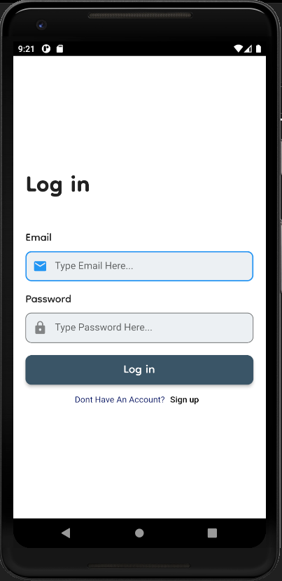
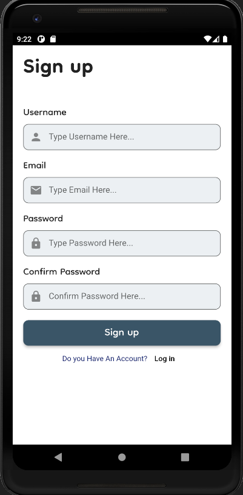
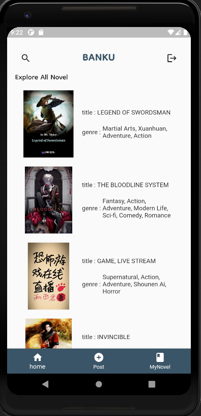
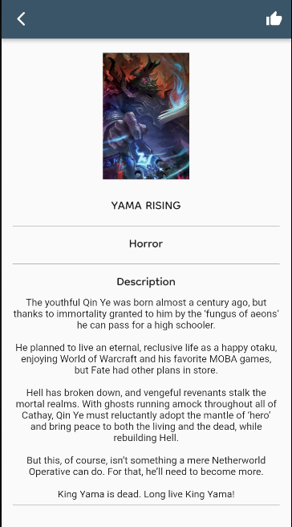
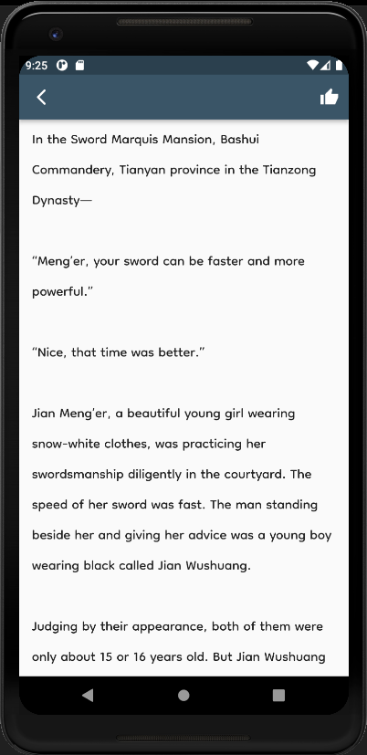
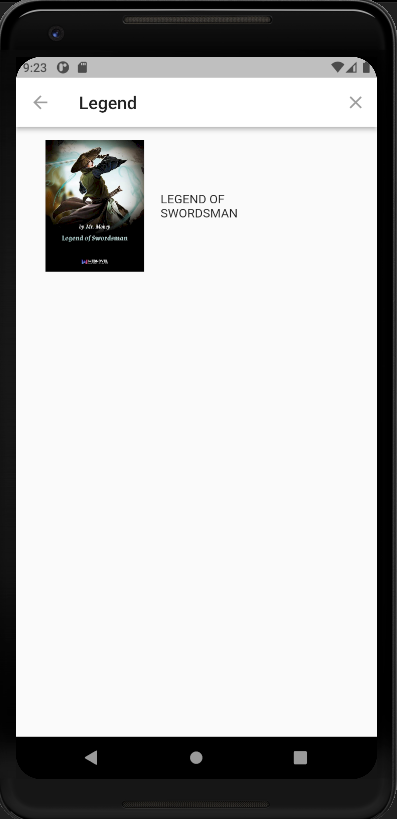
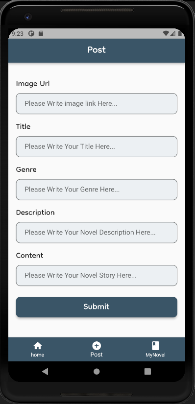
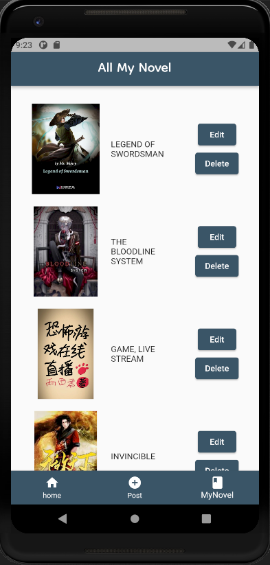
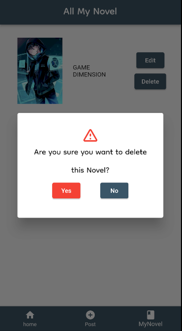
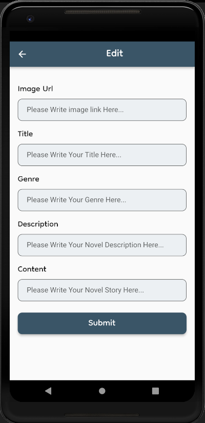

# BANKU ("BAcaaNKU")

Banku adalah sebuah aplikasi bagi penulis untuk mempublikasi karyanya dan juga bagi pembaca untuk membaca novel sepuasnya secara gratis

## Fitur MVP:

- Post Novel
- Read Novel
- Edit Novel
- Delete Novel
- Search Novel

## Screen

- Login Screen
- Register Screen
- Home Screen
- Post Screen
- MyNovel Screen
- Search

## Screenshots

Berikut adalah Screenshot seluruh Screen yang ada pada aplikasi ini :

- login Screen (sebelum masuk ke dalam aplikasi, user harus login terlebih dahulu)

- Register Screen (untuk user yang tidak memiliki akun, maka dapat melakukan register pada screen ini)

- Home Screen (tempat ditampilkannya novel)

- Detail Screen (screen untuk membaca novel)

- Search Screen (untuk user yang ingin mencari novelnya berdasarkan judul novel)

- Post Screen (untuk user yang ingin mempublikasi novelnya)

- MyNovel Screen (untuk user yang sudah melakukan post di fitur post)

- Delete (untuk user yang ingin menghapus novel yang sudah di postnya pada aplikasi ini)

- Edit (untuk user yang ingin melakukan pengeditan pada novelnya sendiri)

## Depedencies

Berikut adalah Package yang digunakan pada aplikasi ini :

cupertino_icons: ^1.0.2
- google_fonts: ^2.3.2
- cloud_firestore: ^3.1.13
- firebase_auth: ^3.3.16
- fluttertoast: ^8.0.9
- dio: ^4.0.6
- http: ^0.13.4
- provider: ^6.0.2
- flutter_spinkit: ^5.1.0
- firebase_core: ^1.17.0
- intl: ^0.17.0
- mockito:
- build_runner: